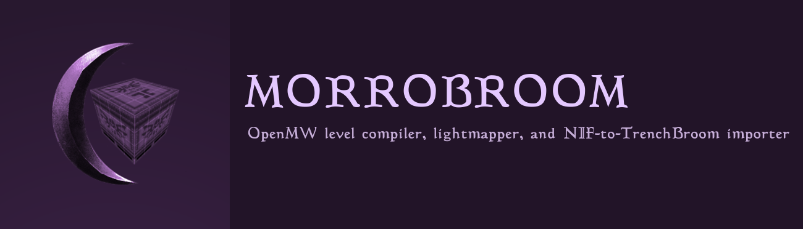

# Morrobroom

**An OpenMW brush compiler, lightmapper, and NIF-to-TrenchBroom importer.**

Morrobroom lets you build Morrowind/OpenMW spaces in [TrenchBroom](https://trenchbroom.github.io/), compile brush geometry into native Morrowind assets, bake static lighting into BC7 lightmaps, place real game objects through generated FGD data, and pull compatible NIF geometry back into editable `.map` form.

In other words: use a Quake editor to build Morrowind.

> this largely exists because people smarter than me said it could not.

OpenMW wrote about the original idea here:

**[From BSP To ESP – How S3ctor Abused Quake Editors to Redefine the Morrowind Modding Experience](https://openmw.org/2024/from-bsp-to-esp-how-s3ctor-abused-quake-editors-to-redefine-the-morrowind-modding-experience/)**

## What It Does

A normal Morrobroom workflow looks like this:

```text
TrenchBroom .map
      │
      ▼
   Morrobroom
      │
      ├── brush geometry and CSG
      ├── Valve 220 texture projection
      ├── game-object compilation
      ├── baked static lighting
      └── BC7 lightmap generation
      │
      ▼
NIF meshes + ESP/ESM/OMWADDON/OMWGAME
      │
      ▼
    OpenMW
```

It can also go the other way:

```text
existing NIF
    │
    ▼
 Morrobroom
    │
    ▼
editable .map geometry
    │
    ▼
 TrenchBroom
```

Morrobroom is not trying to replace Blender or OpenCS. It is for the part of level design where a brush editor is simply faster: rooms, corridors, structures, blockouts, one-off architecture, and anything else that benefits from grabbing a wall and moving it instead of opening a modeling package.

## Highlights

### Build OpenMW levels in TrenchBroom

Morrobroom consumes Quake-style `.map` geometry, reconstructs convex brush solids, performs CSG and occlusion processing, preserves material identity, and emits native NIF geometry.

The canonical authoring format is **Quake 2 with Valve 220 texture projection**.

### Bake static lighting

Morrobroom can generate a second UV set, bake static illumination, compress the result as **BC7 DDS**, and attach it to generated NIF geometry through Morrowind's existing `DarkTexture` path.

That means baked static lighting works in OpenMW **without an engine patch**.

Runtime OpenMW lights can still handle actors and other dynamic objects while the compiled world uses the bake.

Disable lightmaps for a compile with:

```bash
--no-lightmaps
```

### Import NIFs into TrenchBroom

TrenchBroom does not understand Morrowind NIFs. Morrobroom can reconstruct compatible NIF geometry into `.map` form so it can be inspected, reused, or edited as brush geometry.

This is reconstruction, not magic. NIF is a general scene format and `.map` is a brush format, so animated, skinned, highly irregular, or otherwise exotic assets may not have a useful brush representation.

### Generate FGD data from your OpenMW setup

Morrobroom can read an OpenMW configuration and generate an FGD from the active game data.

That means real Morrowind records from your installed game and mods can appear as placeable entities in TrenchBroom even though TrenchBroom cannot render their NIF models directly.

Supported placeable records include things such as statics, doors, lights, activators, weapons, armor, books, ingredients, miscellaneous items, and more.

Morrobroom compiles those authored entities back into actual TES3/OpenMW records and references.

## Quick Start

### Requirements

You will generally want:

- [OpenMW](https://openmw.org/)
- [TrenchBroom](https://trenchbroom.github.io/)
- Morrowind game data available through OpenMW
- a Morrobroom release binary, or a Rust toolchain if building from source

Morrobroom includes its TrenchBroom game configuration, compilation profile, editor assets, and base FGD data under `resources/`.

### Compile a map

```bash
morrobroom compile \
  --map my_level.map \
  --output my_level.omwaddon
```

Lightmapping is enabled by default.

Without baked lightmaps:

```bash
morrobroom compile \
  --map my_level.map \
  --output my_level.omwaddon \
  --no-lightmaps
```

Supported plugin outputs:

```text
.esp
.esm
.omwaddon
.omwgame
```

### Generate an FGD

```bash
morrobroom FGD \
  --config /path/to/openmw.cfg \
  --output Morrowind.fgd
```

You can restrict generation to selected TES3 record types:

```bash
morrobroom FGD \
  --config /path/to/openmw.cfg \
  --types STAT;DOOR;LIGH;ACTI \
  --output Morrowind.fgd
```

## Why TrenchBroom?

Traditional Morrowind worldbuilding is heavily mesh-oriented: build or find assets, then assemble them into a scene.

Brush editors work the other way around. The level itself is editable geometry.

That makes some jobs ridiculously fast:

- block out a room in seconds
- stretch a wall without opening Blender
- cut a doorway into an existing layout
- iterate on proportions directly in the editor
- build one-off architecture without first manufacturing a reusable kit

Morrobroom exists to bridge that workflow into OpenMW.

The original OpenMW article goes much deeper into the idea and its history:

**[From BSP To ESP](https://openmw.org/2024/from-bsp-to-esp-how-s3ctor-abused-quake-editors-to-redefine-the-morrowind-modding-experience/)**

## Slipgate

Morrobroom's geometry frontend is called **Slipgate**.

Slipgate owns the low-level `.map` work: planes, convex hulls, brush reconstruction, topology, material projection, CSG, visible surface fragments, and spatial candidate selection.

The useful version is:

```text
.map
  ↓
Slipgate
  ↓
visible geometry
  ↓
Morrobroom
  ↓
NIF + plugin
```

You generally do not need to think about Slipgate unless you are working on Morrobroom itself.

## Lightmapping

Static geometry uses UV set 0 for the base texture and UV set 1 for the baked lightmap.

Morrobroom currently bakes:

```text
ambient
+ direct authored lights
+ geometric visibility and shadows
```

The result is written as **BC7 UNORM DDS** and attached through `DarkTexture`.

This is not a global-illumination system. Yet.

## Status

Morrobroom is usable, but it is still weird software doing weird things.

The compiler has been exercised on large brush maps, CSG-heavy layouts, many materials, colored lights, large lightmap atlases, and imported NIF geometry. That does not mean every pathological `.map`, NIF, or mod setup will behave perfectly.

Expect sharp edges around:

- malformed or unusual brush geometry
- exotic NIF scene structures
- assets that do not translate cleanly into brushes
- unusual third-party content assumptions
- lightmap settings that need tuning for a particular level

Small reproducible bug reports are much more useful than screenshots of a crater with the caption "it exploded."

## Building From Source

Morrobroom is written in Rust.

```bash
cargo build --release
cargo test
```

## Credits

Morrobroom stands on a lot of excellent work:

- [OpenMW](https://openmw.org/) — the engine Morrobroom targets
- [TrenchBroom](https://trenchbroom.github.io/) — the editor and `.map` workflow
- [`tes3`](https://github.com/Greatness7/tes3) — Rust support for TES3 ESP/NIF data
- the geometry and lightmapping work incorporated into Morrobroom's compiler pipeline

See [`THIRD_PARTY.md`](THIRD_PARTY.md) for detailed attribution and licensing information.

## License

See [`LICENSE`](LICENSE).

---

**Build the level. Compile the level. Bake the level. Put it in Morrowind.**
